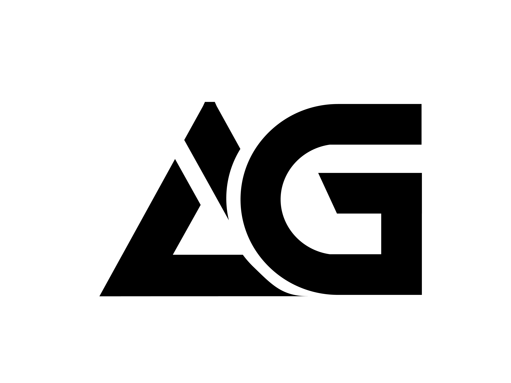

<picture>
  <source media="(prefers-color-scheme: dark)" srcset=".github/assets/logo-dark.png">
  <source media="(prefers-color-scheme: light)" srcset=".github/assets/logo-light.png">
  
</picture>

# criticalbit-web

[](https://github.com/ag-tech-group/criticalbit-web/actions/workflows/ci.yml)
[](LICENSE)

Hub site for [criticalbit.gg](https://criticalbit.gg) — the landing page for the gaming tools platform.

**Live:** [criticalbit.gg](https://criticalbit.gg)

## Pages

| Route      | Description      |
| ---------- | ---------------- |
| `/`        | Landing page     |
| `/privacy` | Privacy policy   |
| `/terms`   | Terms of service |

## Features

- CriticalBit theme (Geist + Geist Pixel Line fonts, charcoal/ice blue palette)
- Shared auth state via `.criticalbit.gg` cookie (sign in/out, avatar, display name)
- Dark mode (default) and light mode with cross-subdomain sync
- User dropdown with profile link and sign out

## Development

```bash
# Install dependencies
pnpm install

# Start dev server
pnpm dev

# Build
pnpm build

# Test
pnpm test:run

# Lint
pnpm lint
```

## License

Apache 2.0 — see [LICENSE](LICENSE).
